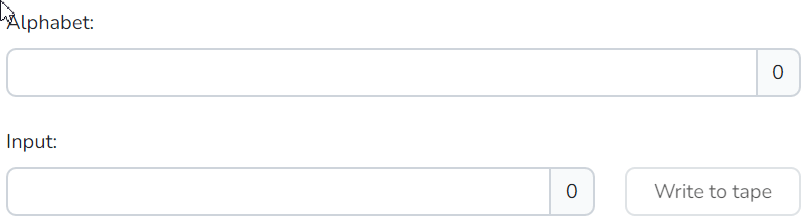
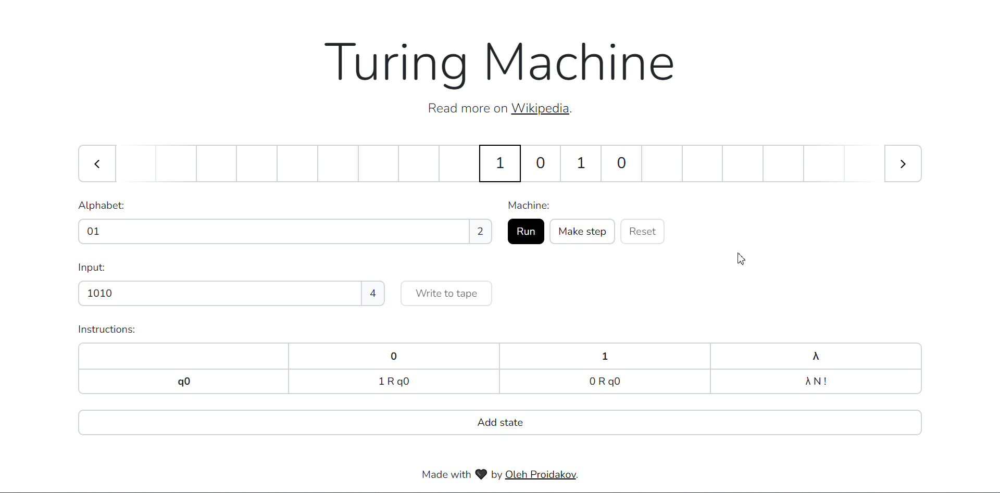

# Turing Machine

A web application that simulates a Turing Machine.

## Getting Started

Open <https://godhermit.github.io/turing-machine> with your browser to see the result.

You can start by defining the alphabet and input value value.

After that, you can enter the instructions for the Turing machine.

Finally, you can run the Turing machine.

## Community

You can ask questions, suggest features, and share your projects on [Github Discussions](https://github.com/GodHermit/turing-machine/discussions).

Please follow our [Code of Conduct](CODE_OF_CONDUCT.md) when you communicate with other people.

## Learn More

To learn more about Next.js, take a look at the following resources:

- [Turing machine](https://en.wikipedia.org/wiki/Turing_machine)
